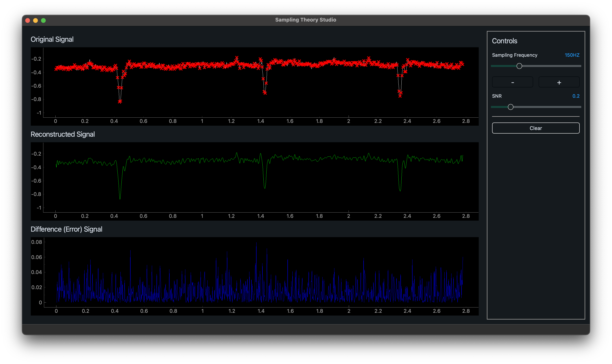

# Signal Sampling Theory Studio

## Introduction

The Signal Sampling Theory Studio is an application designed to sample signals and experiment with sampling frequency and Nyquist theorem. It provides a graphical interface to visualize signals in real-time and allows users to manipulate and analyze data.

## Features

- **Load Signal:** Load a signal from a file or generate an artificial signal using the Signal Composer feature.

- **Experiment with Sampling Frequency:** Adjust the sampling frequency in real-time to observe the effects on the sampled signal.

- **Reconstruct Signal:** Reconstruct the original signal from the sampled data.

- **Noise Simulation:** Simulate noise in the signal to observe its effects on the sampled and reconstructed signals.

- **Display Error Curve:** Visualize the difference between the original signal and the reconstructed signal.



- **Installation:**

  - Prerequisites:

    - Python 3.6 or higher installed
    - Git installed

  - Clone the repository:

    ```
    git clone <repo_url>
    ```

    This will create a local copy of the repository on your machine. Replace the `<repo_url>` with the url of this github repository

  - Navigate to the project directory:

    ```
    cd directory
    ```

    Change to the directory where the repository was cloned.

  - Install the required dependencies:

    ```
    pip install -r requirements.txt
    ```

    This will install all the necessary dependencies for the application.

  - Run the application:
    ```
    python main.py
    ```
    This will start the Signal Sampling Desktop App.
